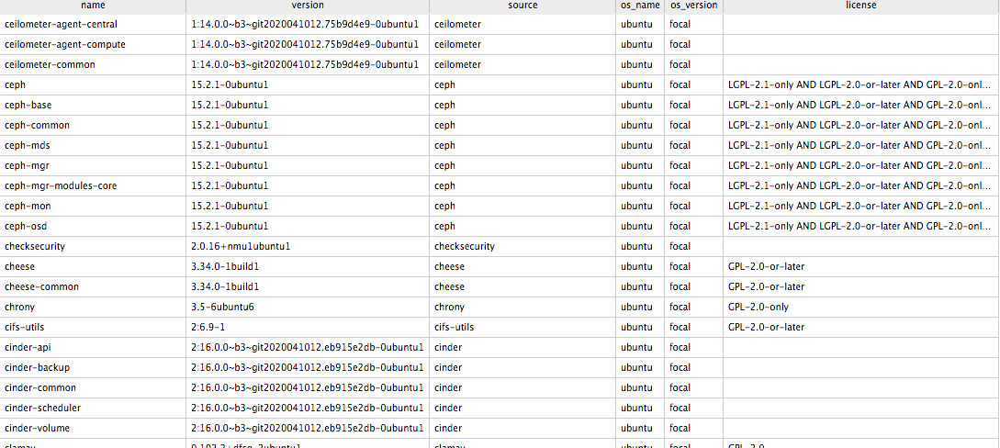
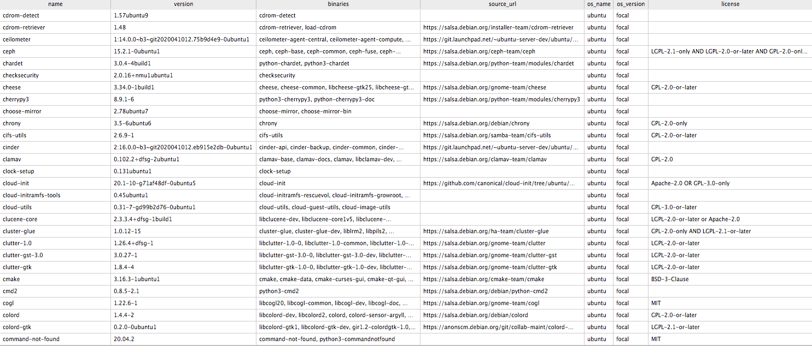

# pkgDB

**Utilites to fetch licenses and package metadata for Debian based OSes**

I built this tool over a weekend sometime back, because it was difficult to figure out the license information of all
packages in Ubuntu in a clean form, and I wanted to experiment with few things, hope it is useful you, kindly raise a
PR on improvements needed.

pkgDB is a standalone tool that:

- Enables you to fetch ubuntu package and source metadata
- Scrape the net for package licenses
- Populate a databse with the metadata and license information
- A REST API interface to interact with the database

## Database

This tool populates a package database for all packages in Ubuntu along with its sources. The two primary tables
available in the database (`packages.db`) are, `sources` and `binaries`.

Let's see some sample output of these tables

### Binaries

The `binaries` table like the name suggests has all the metadata information regarding a package that can be installed 
on Ubuntu using `apt`.

As you can see, it shows the package name, version, os name, version, package license etc. The full list of columns is given below:

| columns    |
|----------- |
|name        |
|version     |
|source      |
|maintainer  |
|homepage    |
|sha1        |
|sha256      |
|pkg_zip     |
|os_name     |
|os_version  |
|license     |

### Sources

The `sources` table like the name suggests has all the metadata information regarding a source package for a binary that 
can be installedon Ubuntu using `apt`.

As you can see, it shows the source package name, version, binary packages associated with the source, os name, version, package license etc.
The full list of columns is given below:

| columns    |
|----------- |
|name        |
|version     |
|binaries    |
|source_url  |
|maintainer  |
|homepage    |
|sha1        |
|sha256      |
|pkg_zip     |
|os_name     |
|os_version  |
|license     |

## REST API

The tool has a REST API that can be used to interface with the database, the `scripts` directory has a bash script to set up a local
packages db to query the database.

## Contributions

This is an OSS tool, any contribution is welcome as long as it is benificial to the community as a whole.
